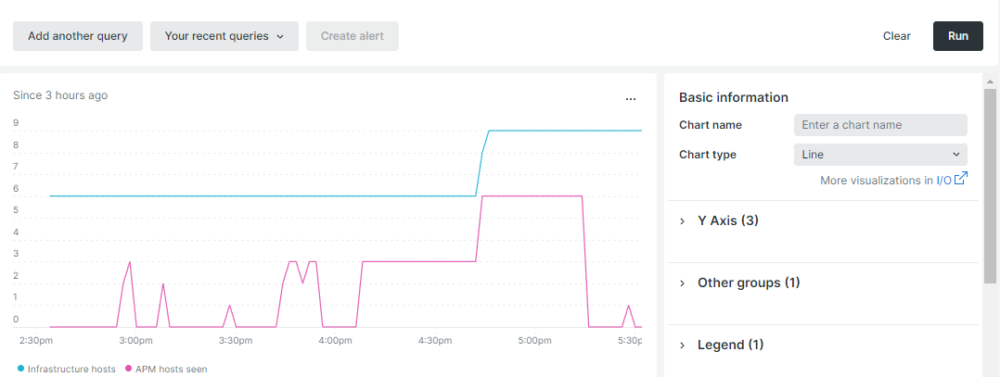

# 자동 크기 조정

Auto scaling은 클라우드 인프라에 리소스를 자동으로 추가하거나 제거하여 최적의 성능과 합리적인 비용을 유지합니다. 현재 이 기능은 [크기 조정된 아키텍처](scaled-architecture.md)로 구성된 프로젝트에만 사용할 수 있습니다.

## 웹 서버 노드

[웹 계층](scaled-architecture.md#web-tier)은(는) 프로세스 요청의 증가와 더 높은 트래픽 요구 사항을 수용하도록 확장됩니다. 현재 자동 확장 기능은 웹 서버 노드를 추가하거나 제거하여 가로로만 확장됩니다.

CPU 사용 및 트래픽이 사전 정의된 임계값에 도달하면 자동 크기 조정 이벤트가 발생합니다.

- **추가된 노드** - 모든 활성 웹 노드의 CPU/코어가 1분 동안 75% 용량이며 트래픽이 5분 연속 20% 증가하고 있습니다.
- **노드가 제거됨**—모든 활성 웹 노드의 CPU/코어가 60%에서 20분 동안 로드됩니다. 노드는 추가된 순서대로 제거됩니다.

최소 및 최대 임계값은 각 판매자의 계약된 리소스 제한을 기반으로 결정 및 설정되므로 무한 규모의 위험이 줄어듭니다.

## New Relic으로 임계값 모니터링

[New Relic 서비스](../monitor/new-relic-service.md)를 사용하여 호스트 수 및 CPU 사용과 같은 특정 임계값을 모니터링할 수 있습니다. 다음 New Relic 쿼리는 예제의 경우에만 `cluster-id`에 대한 변수 표기법을 사용합니다.

>[!TIP]
>
>쿼리 작성에 대한 참조는 _New Relic_ 설명서의 [NRQL 구문, 절 및 함수](https://docs.newrelic.com/docs/query-your-data/nrql-new-relic-query-language/get-started/nrql-syntax-clauses-functions/)를 참조하십시오.
>쿼리를 사용하여 [New Relic 대시보드](https://docs.newrelic.com/docs/query-your-data/explore-query-data/dashboards/introduction-dashboards/)를 만드세요.

### 호스트 수

다음 예제 New Relic 쿼리는 환경 내의 호스트 수를 보여 줍니다.

```sql
SELECT uniqueCount(SystemSample.entityId) AS 'Infrastructure hosts', uniqueCount(Transaction.host) AS 'APM hosts seen' FROM SystemSample, Transaction where (Transaction.appName = 'cluster-id_stg' AND Transaction.transactionType = 'Web') OR SystemSample.apmApplicationNames LIKE '%|cluster-id_stg|%' TIMESERIES SINCE 3 HOURS AGO
```

다음 스크린샷에서 **표시된 APM 호스트**&#x200B;는 선택한 기간 동안 트랜잭션이 기록된 호스트 수를 나타냅니다.



### CPU 사용

다음 예제 New Relic 쿼리는 웹 노드에 대한 CPU 사용을 보여 줍니다.

```sql
SELECT average(cpuPercent) FROM SystemSample FACET hostname, apmApplicationNames WHERE instanceType LIKE 'c%' TIMESERIES SINCE 3 HOURS AGO
```


## 자동 크기 조정 활성화

클라우드 인프라 프로젝트에서 Adobe Commerce 자동 확장을 활성화하거나 비활성화하려면 [Adobe Commerce 지원 티켓을 제출](https://experienceleague.adobe.com/docs/commerce-knowledge-base/kb/help-center-guide/magento-help-center-user-guide.html?lang=ko#submit-ticket)하십시오. 티켓에서 다음 이유를 선택하십시오.

- **연락처 이유**: 인프라 변경 요청
- **Adobe Commerce 인프라 연락처 이유**: 기타 인프라 변경 요청

>[!IMPORTANT]
>
>자동 크기 조정 기능은 예상치 못한 이벤트를 캡처합니다. 자동 크기 조절을 활성화한 경우에도 예정된 이벤트가 예상되면 [Adobe Commerce 지원 티켓 제출](https://experienceleague.adobe.com/docs/commerce-knowledge-base/kb/help-center-guide/magento-help-center-user-guide.html?lang=ko#submit-ticket)을 계속하는 것이 좋습니다.

### 로드 테스트

Adobe은 먼저 클라우드 프로젝트 _스테이징_ 클러스터에서 자동 크기 조절을 활성화합니다. 사용자 환경에서 로드 테스트를 수행하고 완료되면 Adobe에서 프로덕션 클러스터에 대한 Auto Scaling을 활성화합니다. 부하 테스트에 대한 지침은 [성능 테스트](../launch/checklist.md#performance-testing)를 참조하십시오.

### IP 허용 목록

Auto Scaling을 활성화한 후 아웃바운드 웹 노드 트래픽은 서비스 노드의 IP 주소에서 발생합니다. 클라우드 인프라 프로젝트에서 Adobe Commerce과 번들로 제공되지 않는 타사 서비스와 함께 허용 목록에 추가하다를 사용하는 경우 타사 서비스 허용 목록에 추가하다에서 IP 주소를 확인하십시오.

For example:

- 허용 목록에 추가하다에 서비스 노드의 IP 주소(1, 3)가 포함되어 있으면 별도의 작업이 필요하지 않습니다.
- 허용 목록에 서비스 노드(4, 5, 6)의 IP 주소(1, 2, 3)가 포함되어 있으면 별도의 조치가 필요 없습니다.
- 허용 목록에 _웹 노드 4개, 5개, 6개의 IP 주소만 포함된 경우_&#x200B;에 해당 서비스의 IP 주소를 포함하도록 허용 목록을 업데이트해야 합니다.

