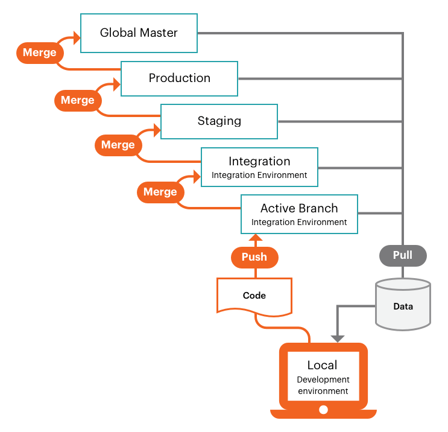

# Pro 프로젝트 워크플로

Pro 프로젝트에는 글로벌 `master` 분기와 세 개의 기본 환경이 있는 단일 Git 저장소가 포함되어 있습니다.

1. 라이브 사이트를 시작 및 유지 관리하기 위한 **프로덕션** 환경
1. 모든 서비스를 사용하여 테스트하기 위한 **스테이징** 환경
1. 개발 및 테스트를 위한 **통합** 환경


이러한 환경은 `read-only`이며 로컬 작업 영역에서 푸시된 분기의 배포된 코드 변경 사항만 수락합니다.

다음 그래픽은 간단한 git 분기 접근 방식을 사용하는 Pro 개발 및 배포 워크플로우를 보여 줍니다. [ 환경을 기반으로 하는 활성 분기를 사용하여 ](#development-workflow)개발`integration` 코드를 사용합니다. 원격 활성 분기에서 _푸싱_ 및 _당기기_ 코드 변경 사항을 가져옵니다. 원격 분기를 _병합_&#x200B;하여 해당 환경에 대해 자동화된 [빌드 및 배포](#deployment-workflow) 프로세스를 활성화하는 기본 분기로 확인된 코드를 배포합니다.



환경은 읽기 전용이므로 클라우드 환경에서 직접 코드를 변경할 수 없습니다. `composer install`을(를) 실행하여 모듈을 설치하려고 하면 다음과 같은 오류가 발생합니다.

```bash
file_put_contents(...): Failed to open stream: Read-only file system  
The disk hosting /app/<cluster_ID> is full
```

>[!NOTE]
>
>이러한 제한은 애플리케이션의 무결성과 보안을 보호합니다. 이러한 읽기 전용 파일 시스템에 대한 폴더 권한은 변경할 수 없습니다. 지원 팀에서도 수정할 수 없습니다. 모든 변경 내용은 로컬 개발 환경의 분기에서 수행한 후 애플리케이션 환경으로 푸시해야 합니다. 자세한 내용은 Pro 환경에 대한 개요는 [Pro 아키텍처](pro-architecture.md)를, 프로젝트 보기의 Pro 환경 목록에 대한 개요는 [[!DNL Cloud Console]](../project/overview.md#cloud-console)을(를) 참조하십시오.

## 개발 워크플로

통합 환경은 클라우드 인프라 코드에서 Adobe Commerce을 포함하는 단일 기본 `integration` 분기를 제공합니다. 추가 활성 환경 분기를 만들 수 있습니다. 이렇게 하면 PaaS(Platform as a Service) 컨테이너에 최대 2개의 활성 분기가 배포됩니다. 비활성 환경의 수에는 제한이 없지만 비활성 환경이 많을수록 Cloud Console을 로드하는 데 더 오랜 시간이 걸립니다.

{{enhanced-integration-envs}}

프로젝트 환경은 유연하고 지속적인 통합 프로세스를 지원합니다. 로컬 프로젝트 폴더에 `integration` 분기를 복제하는 것부터 시작합니다. 분기 또는 여러 분기를 만들고, 새 기능을 개발하고, 변경 사항을 구성하고, 확장을 추가하고, 업데이트를 배포합니다.

- **에서**&#x200B;변경 내용 가져오기`integration`

- **의**&#x200B;분기`integration`

- **업데이트를 포함하여 로컬 워크스테이션에서**&#x200B;개발[!DNL Composer] 코드

- 원격으로 **푸시** 코드 변경 및 유효성 검사

- **에**&#x200B;병합`integration` 및 테스트

개발된 코드 분기 및 해당 구성 파일을 사용하면 보다 포괄적인 테스트를 위해 코드 변경 내용을 `integration` 분기에 병합할 준비가 되었습니다. `integration` 환경도 다음 경우에 가장 적합합니다.

- **타사 서비스 통합**—PaaS 환경에서 일부 서비스를 사용할 수 없습니다.

- **구성 관리 파일 생성**—배포된 환경에서 일부 구성 설정은 _읽기 전용_&#x200B;입니다.

- **저장소 구성**—통합 환경을 사용하여 모든 저장소 설정을 완전히 구성해야 합니다. **의**&#x200B;통합&#x200B;_환경 보기에서_&#x200B;저장소 관리자 URL _[!DNL Cloud Console]_을 찾을 수 있습니다.

## 배포 워크플로

로컬 워크스테이션에서 원격 환경으로 코드를 푸시하거나 환경 분기에 코드를 병합할 때마다 빌드 및 배포 스크립트는 새 코드를 생성하고 구성된 서비스를 원격 환경에 프로비저닝합니다.

스크립트 작업 빌드:

- 대상 환경의 사이트는 빌드 중에 계속 실행됩니다.

- 클라우드 인프라 패치 및 핫픽스에서 Adobe Commerce 확인 및 실행

- 빌드 및 배포 로그로 코드 컴파일

- 구성 관리 확인. 이 단계에서 정적 콘텐츠 배포가 발생합니다.

- 변경되지 않은 코드의 슬러그를 만들거나 사용하여 프로세스 속도 향상

- 모든 백엔드 서비스 및 애플리케이션 프로비저닝

스크립트 작업 배포:

- 사이트를 대상 환경에 _유지 관리_ 모드로 설정합니다.

- 빌드하는 동안 완료되지 않은 경우 정적 콘텐츠 배포

- 클라우드 인프라에 Adobe Commerce 설치 또는 업데이트

- 트래픽에 대한 라우팅 구성

빌드 및 배포 프로세스가 완료되면 저장소가 최신 코드 변경 사항 및 구성과 함께 다시 온라인으로 전환됩니다. [배포 프로세스](../deploy/process.md)를 참조하세요.

### 통합에 병합

활성 개발 분기를 기본 `integration` 분기로 병합하여 확인된 모든 코드 변경 내용을 결합합니다. 스테이징 환경에 대한 변경 내용을 승격하기 전에 `integration` 분기에서 모든 변경 내용을 테스트할 수 있습니다.

### 스테이징으로 병합

스테이징은 모든 서비스와 설정을 가능한 한 프로덕션 환경에 가깝게 제공하는 사전 프로덕션 환경입니다. 모든 서비스에서 철저한 테스트를 수행할 수 있도록 항상 코드 변경 내용을 `integration` 환경에서 `staging` 환경으로 푸시하십시오. 스테이징 환경을 처음 사용하는 경우 [Fastly CDN](../cdn/fastly.md) 및 [New Relic](../monitor/new-relic-service.md)과 같은 서비스를 구성해야 합니다. 샌드박스 또는 테스트 자격 증명을 사용하여 결제 게이트웨이, 배송, 알림 및 기타 중요한 서비스를 구성합니다.

스토어에서 프로덕션 환경이 준비되었다고 판단될 때까지 모든 서비스를 철저히 테스트하고, 성능 테스트 도구를 확인하고, 관리자 및 고객으로서 UAT 테스트를 수행하는 것이 가장 좋습니다. [스토어 배포](../deploy/staging-production.md)를 참조하세요.

{{second-staging}}

### 프로덕션에 병합

스테이징 환경에서 철저한 테스트 후 프로덕션 환경으로 병합하고 라이브 자격 증명을 사용하여 철저하게 테스트합니다. 프로덕션 사이트를 시작하는 순간 고객은 구매를 완료할 수 있어야 하며 관리자는 라이브 스토어를 관리할 수 있어야 합니다. 스토어 배포 및 실행에 대한 구체적이고 명확한 연습은 다음 항목을 참조하십시오.

- [스토어 배포](../deploy/staging-production.md)
- [사이트 시작](../launch/overview.md)

### 글로벌 기본으로 병합

서비스를 중단하지 않고 프로덕션 환경을 디버깅해야 하는 경우 항상 프로덕션 코드의 복사본을 전역 `master`에 푸시합니다.

**글로벌에서 분기를**&#x200B;만들 수 없음`master`. `integration` 분기를 사용하여 개발 및 수정을 위한 활성 분기를 새로 만드십시오.
