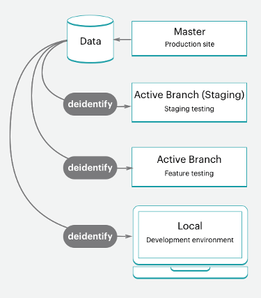

# 스타터 프로젝트 워크플로

클라우드 인프라의 Adobe Commerce에는 테스트 및 개발 작업을 위한 스테이징 및 다중 통합 환경을 만들기 위해 분기할 수 있는 프로덕션 환경용 `master` 분기가 있는 단일 Git 저장소가 포함되어 있습니다. 프로덕션 서버용 `master` 환경을 포함하여 최대 4개의 활성 환경을 가질 수 있습니다. 개요는 [Starter 아키텍처](starter-architecture.md)를 참조하십시오.

환경의 경우 [!UICONTROL Development > Staging > Production] 워크플로에 따라 사이트를 개발하고 배포하십시오.

- **프로덕션 환경(라이브 사이트)** - `master` 분기의 코드에서 빌드되고 배포된 모든 서비스가 포함된 전체 프로덕션 환경을 제공합니다.
- **스테이징 환경**—`master`에서 복제하여 만든 `staging` 분기에서 빌드되고 배포된 모든 서비스와 프로덕션 환경과 일치하는 전체 스테이징 환경을 제공합니다.
- **통합 환경** - `staging` 분기에서 만드는 활성 개발 환경을 최대 두 개까지 제공합니다. `integration` 환경은 Fastly 및 New Relic 같은 서드파티 서비스를 지원하지 않습니다.

분기의 경우 모든 개발 방법을 따를 수 있습니다. 예를 들어 스크럼과 같은 애자일 방법론에 따라 모든 스프린트에 대한 분기를 만들 수 있습니다.

각 스프린트에서 모든 사용자 스토리에 대한 분기를 만들 수 있습니다. 모든 이야기는 시험할 수 있게 된다. 스프린트 분기에 계속 병합하여 해당 분기를 지속적으로 확인할 수 있습니다. 스프린트가 종료되면 테스트 병목 현상을 처리할 필요 없이 스프린트 분기를 `master`에 병합하여 모든 스프린트 변경 내용을 프로덕션에 배포할 수 있습니다.

## 개발 워크플로

스타터 계획에서의 개발 및 배포는 초기 프로젝트로 시작됩니다. 완전히 준비된 스토어가 있는 Adobe Commerce on cloud infrastructure 템플릿 코드 저장소인 &quot;빈 사이트&quot;를 사용하여 프로젝트를 만듭니다. 프로덕션 환경의 코드 사본이 포함된 `master` 분기가 만들어집니다.

개발 워크플로우는 다음과 같이 구성됩니다.

- `master`에서 [분기 및 &#x200B;](#clone-and-branch)을(를) 복제하여 `staging` 및 개발 분기를 만듭니다.
- [코드를 개발](#develop-code)하고 [!DNL Composer] 업데이트를 포함하여 개발 분기에 확장을 로컬로 설치합니다.
- 저장소 및 확장 설정을 [구성](#configure-store)합니다.
- [구성 생성](#generate-configuration-management-files) 관리 파일
- [푸시 코드](#push-code-and-test) 및 구성을 만들어 `staging` 및 `production` 환경에 배포합니다.


코드 및 스토어 데이터를 개발하고 테스트하는 데 도움이 되는 몇 가지 선택적 단계도 있습니다.

- 스토어에 [샘플 데이터 설치](#optional-install-sample-data)
- [프로덕션 저장소 데이터를 환경으로 가져오기](#optional-pull-production-data)

이 프로세스에서는 사용자가 [로컬 개발자 작업 공간](../development/overview.md)을 설정한 것으로 가정합니다.

### 복제 및 분기

새 시작 계획 프로젝트의 경우 `master` 분기가 클라우드 인프라 Git 저장소의 Adobe Commerce에서 복제되었습니다. 분기 및 코드 작업을 시작하려면 `master` 분기를 로컬 환경에 복제합니다.

Git clone 명령의 형식은 다음과 같습니다.

```bash
git fetch origin
```

```bash
git pull origin <environment-ID>
```

시작 프로젝트의 분기에서 처음 작업을 시작하면 `staging` 분기를 만듭니다. 이렇게 하면 프로덕션 환경에 배포하기 전에 구성 및 코드 변경을 테스트하기 위해 스테이징 환경에 배포하는 `master` 분기와 일치하는 코드 분기가 만들어집니다.

그런 다음 `staging`에서 분기를 만들어 코드를 개발하고, 확장을 추가하고, 서드파티 통합을 구성합니다. 사용자 지정 코드를 개발하고, 확장을 추가하고, 서드파티 서비스와 통합할 때마다 `staging` 분기에서 만든 개발 분기에서 작업합니다. 사용 가능한 활성 통합 환경이 4개 있습니다. 활성 분기를 푸시하면 이러한 통합 환경 중 하나에서 코드를 테스트용으로 자동 배포합니다.

Git 분기 명령의 형식은 다음과 같습니다.

```bash
git checkout <branch-name>
```

Cloud CLI `branch` 명령의 형식은 다음과 같습니다.

```bash
magento-cloud environment:branch <environment-name> <parent-environment-ID>
```


### 코드 개발

클라우드 인프라 코드에서 Adobe Commerce의 기본 분기를 사용하면 확장 설치, 사용자 지정 코드 개발, 테마 추가 등을 시작할 수 있습니다.

개발 작업에 분기 전략을 사용합니다. 한 분기를 사용하여 모든 작업을 한 번에 수행하면 테스트가 어려울 수 있습니다. 예를 들어 지속적인 통합 및 스프린트 방법론을 따라 작업할 수 있습니다.

- 몇 개의 확장을 추가하고 첫 번째 분기로 구성합니다.
- 이 코드를 푸시하고 테스트하고 스테이징에 병합한 다음 프로덕션으로 병합합니다.
- `services.yaml`에서 서비스를 완전히 구성하고 테마를 추가하십시오.
- 이 코드를 푸시하고 테스트하고 스테이징에 병합한 다음 프로덕션으로 병합합니다.
- 타사 서비스와 통합
- 이 코드를 푸시하고 테스트하고 스테이징에 병합한 다음 프로덕션으로 병합합니다.

스토어를 완전히 빌드하고, 구성하고, 시작할 준비가 될 때까지. 하지만 저장소 및 코드 구성에 대한 여러 가지 옵션이 있으므로 계속 읽어 보십시오.

>[!NOTE]
>
>아직 로컬 워크스테이션에서 구성을 완료하지 마십시오.


### 저장소 구성

스토어를 구성할 준비가 되면 모든 코드를 `integration` 환경에 푸시합니다. 로컬 환경이 아닌 통합 환경에 대한 관리에서 스토어 설정을 구성합니다. [!DNL Cloud Console]에서 **사이트 액세스**&#x200B;를 클릭하여 URL을 찾을 수 있습니다.

구성에 대한 최상의 정보는 Adobe Commerce 및 설치된 확장에 대한 설명서를 참조하십시오. 시작하는 데 도움이 되는 몇 가지 링크 및 아이디어는 다음과 같습니다.

- 클라우드의 특정 모범 사례에 대한 [저장소 구성 모범 사례](../store/best-practices.md)
- 저장소 관리자 액세스, 이름, 언어, 통화, 브랜딩, 사이트, 저장소 보기 등에 대한 [기본 구성](https://experienceleague.adobe.com/ko/docs/commerce-admin/start/setup/store-details)
- CSS와 레이아웃을 포함한 사이트 및 스토어의 모양과 느낌을 위한 [테마](https://experienceleague.adobe.com/ko/docs/commerce-admin/content-design/content-menu#design-features)
- 데이터베이스의 역할, 도구, 알림 및 암호화 키에 대한 [시스템 구성](https://experienceleague.adobe.com/ko/docs/commerce-admin/systems/guide-overview)
- 해당 설명서를 사용한 확장 설정

단순한 저장소 설정 외에도 여러 사이트 및 저장소, 구성된 서비스 등을 추가로 구성할 수 있습니다. [스토어 구성](../store/overview.md)을 참조하세요.

### 구성 관리 파일 생성

Adobe Commerce에 익숙하다면 개발 중인 데이터베이스에서 스테이징 및 프로덕션 환경으로 구성 설정을 가져오는 방법에 대해 걱정할 수도 있습니다. 이전에는 모든 구성 설정을 용지 또는 파일에 복사한 다음 수동으로 다른 환경에 적용해야 했습니다. 또는 데이터베이스를 덤프하고 해당 데이터를 다른 환경에 푸시했을 수 있습니다.

클라우드 인프라의 Adobe Commerce은 환경에서 파일로 구성 설정을 내보내는 두 개의 [구성 관리](../store/store-settings.md) 명령 집합을 제공합니다. 이 명령은 **클라우드 인프라 2.2 이상의 Adobe Commerce**&#x200B;에서만 사용할 수 있습니다.

- `php .vendor/bin/ece-tools config:dump` - 기본값에서 입력하거나 수정한 구성 설정만 구성 파일로 내보냅니다. _권장_.
- `php bin/magento app:config:dump` - 수정된 구성 설정과 기본값을 포함한 모든 구성 설정을 구성 파일로 내보냅니다.

생성된 파일은 `app/etc/config.php`입니다.

Adobe Commerce을 구성한 통합 환경에서 파일을 생성합니다. 파일을 생성하여 분기에 추가하고 배포하는 프로세스를 단계별로 수행합니다.

구성 관리에 대한 **중요 정보**:

- `app:config:dump` 명령에서 생성된 파일에 포함된 모든 구성 설정은 배포된 환경에서 편집 또는 읽기 전용이 금지됩니다. 이는 Adobe이 `.vendor/bin/ece-tools config:dump` 명령을 사용하는 것이 좋습니다.

  예를 들어 개발 환경에 Fastly용 모듈을 설치합니다. 스테이징 및 프로덕션 환경에서만 이 모듈을 구성할 수 있습니다. `.vendor/bin/ece-tools config:dump` 명령을 사용하면 개발 변경 내용을 스테이징 및 프로덕션 환경에 배포할 때 이러한 기본 필드를 편집할 수 있습니다.

- 생성된 파일은 배포 크기에 따라 길 수 있습니다. `.vendor/bin/ece-tools config:dump` 명령은 `app:config:dump` 명령에 의해 생성된 파일보다 작은 파일을 생성합니다.

Adobe Commerce 버전 2.2 이상을 사용하는 경우 구성 관리 명령은 PayPal 모듈의 샌드박스 자격 증명과 같은 중요한 데이터를 보호하는 추가 기능을 제공합니다. 내보내는 동안 중요한 데이터가 포함된 모든 값을 `app/etc/` 디렉터리의 별도 구성 파일—`env.php`(으)로 내보냅니다. 이 파일은 로컬 환경에 유지되며 코드를 다른 분기에 푸시할 때 복사되지 않습니다. 클라우드 인프라 버전의 모든 Adobe Commerce에서 CLI 명령을 사용하여 환경 변수를 만들 수도 있습니다.


[구성 관리](../store/store-settings.md)를 참조하십시오.

### 푸시 코드 및 테스트

이 시점에서 테스트할 준비가 된 구성 파일(`config.local.php` 또는 `config.php`)이 있는 개발된 코드 분기가 있어야 합니다.

로컬 환경에서 코드를 푸시할 때마다 일련의 빌드 및 배포 스크립트가 실행됩니다. 이러한 스크립트는 새 코드를 생성하여 원격 환경에 배포합니다. 예를 들어 로컬 환경에서 원격 분기로 개발 분기를 푸시하는 경우 일치하는 환경은 서비스, 코드 및 정적 콘텐츠를 업데이트합니다.

저장소 URL, 관리자 URL 및 SSH를 사용하여 이 환경에 직접 액세스할 수 있습니다. 이러한 환경에는 웹 서버, 데이터베이스 및 구성된 서비스가 포함됩니다. 준비가 되면 스테이징 환경에서 배포 및 테스트를 시작할 수 있습니다.

자세한 내용은 [배포 워크플로](#deployment-workflow)를 참조하십시오.

### 선택 사항: 샘플 데이터 설치

스토어를 개발할 때 예제 데이터가 필요한 경우 샘플 데이터를 설치할 수 있습니다. 이 데이터는 고객, 제품 및 기타 데이터를 포함하여 활성 스토어를 시뮬레이션합니다. 이 샘플 데이터는 프로젝트를 만들 때 클라우드 인프라 템플릿 설치에 있는 &quot;빈 사이트&quot; Adobe Commerce에서 가장 잘 작동합니다. 라이브로 전환하기 전에 샘플 데이터를 제거하는 것이 좋습니다. [선택적 샘플 데이터 설치](../test/sample-data.md)를 참조하십시오.


### 선택 사항: 프로덕션 데이터 가져오기

모든 제품, 카탈로그, 사이트 콘텐츠 등을 `production` 환경에 직접 추가합니다. 이 데이터를 프로덕션 환경에 추가하면 업데이트된 가격, 쿠폰, 재고, 판매 공지, 향후 오퍼링에 대한 정보 등을 고객에게 제공할 수 있습니다. 이 데이터에는 로컬 개발 분기에 구성하는 확장 구성이 포함되지 않습니다.

기능을 개발하고, 확장을 추가하고, 테마를 디자인할 때 사용할 실제 데이터를 보유하는 것이 유용합니다. 언제든지 프로덕션 환경에서 [데이터베이스 덤프를 만들고](../storage/database-dump.md)필요에 따라 스테이징 및 통합 환경으로 푸시할 수 있습니다.

스테이징 및 통합 환경에서 사용할 테스트 데이터로 프로덕션 데이터를 내보내려면 다음을 수행합니다.

- Adobe Commerce 암호화 키를 사용하여 고객의 보호된 백업을 내보내고 데이터를 저장할 때 [지원 유틸리티를 실행](https://experienceleague.adobe.com/docs/commerce-operations/configuration-guide/cli/run-support-utilities.html?lang=ko) CLI 명령(권장)

- 데이터를 생성하고 내보내는 [데이터 수집](https://experienceleague.adobe.com/ko/docs/commerce-admin/systems/tools/support#data-collector) 도구

이 데이터를 마이그레이션하려면 [정적 파일 및 데이터 마이그레이션 및 배포](../deploy/staging-production.md#migrate-static-files)를 참조하세요.



>[!NOTE]
>
>데이터를 다른 환경으로 푸시하기 전에 데이터를 삭제하는 것을 고려해야 합니다. [지원 유틸리티 사용](https://experienceleague.adobe.com/docs/commerce-operations/configuration-guide/cli/run-support-utilities.html?lang=ko) 또는 스크립트를 개발하여 고객 데이터를 삭제하는 등 몇 가지 옵션이 있습니다.

>[!WARNING]
>
>통합 또는 스테이징 환경에서 프로덕션 환경으로 데이터베이스를 푸시하지 마십시오. 이 경우 통합 또는 스테이징 환경의 데이터가 판매, 주문, 신규 및 업데이트된 고객 등을 포함한 라이브 프로덕션 데이터를 덮어씁니다.

## 배포 워크플로

아키텍처 정보에 자세히 나와 있듯이 클라우드 인프라의 Adobe Commerce은 Git 기반입니다. 클라우드 인프라에 Adobe Commerce 배포는 분기에 대한 Git 푸시 프로세스의 일부입니다.

로컬 환경에서 원격 분기로 분기된 코드를 푸시하면 일련의 빌드 및 배포 스크립트가 시작됩니다.

스크립트 작성:

- 빌드 중에 타겟 환경의 사이트가 계속 실행됩니다

- 클라우드 인프라 패치 및 핫픽스에서 Adobe Commerce 확인 및 실행

- 빌드 및 배포 로그로 코드 컴파일

- 이 단계 중에 정적 콘텐츠 배포가 발생하는 경우 구성 관리를 확인하십시오

- 더 빠른 프로세스를 위해 변경되지 않은 코드의 슬러그를 만들거나 사용하십시오.

- 모든 백엔드 서비스 및 애플리케이션 프로비저닝

스크립트 배포:

- 사이트를 타겟 환경에 유지 관리 모드로 전환합니다.

- 빌드하는 동안 완료되지 않은 경우 정적 콘텐츠 배포

- 클라우드 인프라에 Adobe Commerce 설치 또는 업데이트

- 트래픽에 대한 라우팅 구성

완료되면 스토어가 업데이트된 모든 코드 및 구성과 함께 실시간으로 온라인 상태로 돌아갑니다.

[배포 프로세스](../deploy/process.md)를 참조하세요.

### 스테이징으로 푸시 및 테스트

전체 테스트를 위해 항상 코드를 `staging` 환경에 반복적으로 푸시합니다. 이 환경을 처음 사용하는 경우 [Fastly](/help/cloud-guide/cdn/fastly.md) 및 [New Relic](../monitor/new-relic-service.md)을(를) 포함한 몇 가지 서비스를 구성해야 합니다. 또한 샌드박스 또는 테스트 자격 증명을 사용하여 결제 게이트웨이, 배송, 알림 및 기타 중요한 서비스를 구성합니다.

스테이징은 모든 서비스와 설정을 가능한 한 프로덕션에 가깝게 제공하는 프로덕션 이전 환경입니다. 모든 서비스를 철저히 테스트하고, 성능 테스트 도구를 확인하고, 관리자로서 그리고 고객으로서 UAT 테스트를 수행하여 스토어가 프로덕션 준비가 되었다고 느낄 때까지 테스트하십시오.

[스토어 배포](../deploy/staging-production.md)를 참조하세요.

### 프로덕션으로 푸시

`master` 분기로 푸시하면 `production` 환경으로 푸시합니다. 한 가지 중요한 차이점이 있는 스테이징 환경에서와 마찬가지로 프로덕션 환경에서도 전체 구성 및 테스트 활동을 수행할 수 있습니다. 프로덕션 환경에서는 구성 및 테스트를 위해 라이브 자격 증명을 사용합니다. 사이트를 시작하는 순간 고객은 구매를 완료할 수 있으며 관리자는 라이브 스토어를 관리할 수 있습니다.

[스토어 배포](../deploy/staging-production.md)를 참조하세요.

### 사이트 시작

사이트를 라이브로 진행하기 위한 명확한 연습이 있습니다. 이러한 단계를 완료하면 스토어에서 즉시 맞춤화된 테마의 제품을 판매할 수 있습니다.

[사이트 시작](../launch/overview.md)을 참조하세요.

## 지속적인 통합

분기 및 개발 방법론을 따라 새로운 기능을 쉽게 개발하고, 변경 사항을 구성하고, 확장을 추가하여 업데이트를 지속적으로 개발 및 배포할 수 있습니다.

모든 클라우드 인프라 환경은 지속적인 업데이트를 위한 지속적인 통합을 지원합니다. 이 워크플로우는 비즈니스 요구 사항에 따라 하루에 여러 번 또는 정해진 일정에 따라 릴리스를 지원합니다.

- 향후 기능 및 변경 사항으로 개발 분기 생성

- `integration` 환경에서 코드 테스트

- `staging` 환경에서 배포 및 테스트

- `production` 환경에 배포
