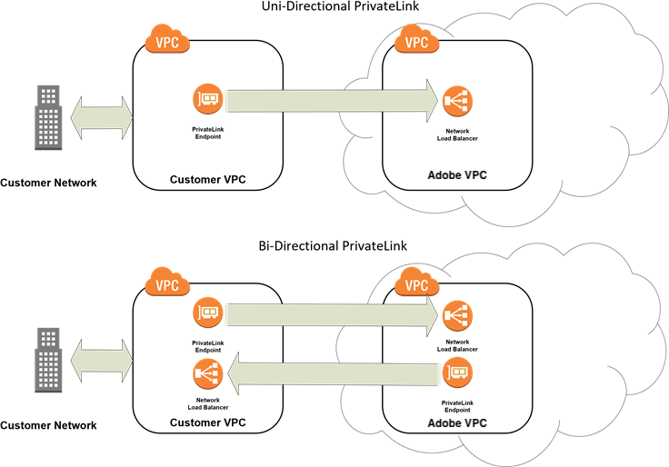

# PrivateLink 서비스

클라우드 인프라의 Adobe Commerce은 [AWS PrivateLink](https://aws.amazon.com/privatelink/) 또는 [Azure Private Link](https://learn.microsoft.com/en-us/azure/private-link/) 서비스와의 통합을 지원합니다. PrivateLink를 사용하여 외부 시스템에 호스팅된 서비스 및 애플리케이션을 사용하는 클라우드 인프라 환경의 Adobe Commerce 간에 안전한 개인 통신을 설정할 수 있습니다. Adobe Commerce 애플리케이션과 외부 시스템은 모두 동일한 클라우드 영역 내의 동일한 클라우드 플랫폼(AWS 또는 Azure)에 구성된 VPC(Virtual Private Cloud) 종단점을 통해 액세스할 수 있어야 합니다.

>[!TIP]
>
>PrivateLink는 데이터베이스 또는 파일 전송과 같은 비 HTTP(S) 통합에 대한 연결을 보호하는 데 가장 적합합니다. 애플리케이션을 Adobe Commerce API와 통합하려면 [Adobe Developer App Builder용 API Mesh](https://developer.adobe.com/graphql-mesh-gateway/gateway/create-mesh/)에서 _Adobe API Mesh_&#x200B;을(를) 만드는 방법을 참조하십시오.

## 기능 및 지원

클라우드 인프라 프로젝트에서 Adobe Commerce을 위한 PrivateLink 서비스 통합에는 다음 기능 및 지원이 포함됩니다.

- 동일한 클라우드 영역 내의 동일한 클라우드 플랫폼(VPC 또는 Azure)에서 고객 Virtual Private Cloud(AWS)와 Adobe VPC 간의 보안 연결입니다.
- Adobe과 고객 VPC에서 사용할 수 있는 엔드포인트 서비스 간의 단방향 또는 양방향 통신을 지원합니다.
- 서비스 지원:

   - Adobe Commerce on cloud infrastructure 환경에서 필요한 포트 열기
   - 고객과 Adobe VPC 간의 초기 연결 설정
   - 활성화 중 연결 문제 해결

## 제한 사항

- PrivateLink는 Pro 프로덕션 및 스테이징 환경에서만 지원됩니다. 로컬 또는 통합 환경이나 스타터 프로젝트에서는 사용할 수 없습니다.
- PrivateLink를 사용하여 SSH 연결을 설정할 수 없습니다. [SSH 키 사용](secure-connections.md)을 참조하세요.
- Adobe Commerce 지원에서는 초기 지원 외에 AWS PrivateLink 문제 해결을 다루지 않습니다.
- 고객은 자체 VPC 관리와 관련된 비용을 부담합니다.
- 플랫폼별 **HTTPS 프로토콜(포트 443) 지원:**
   - **Azure 개인 링크**: [Fastly 원본 클로킹](https://experienceleague.adobe.com/docs/commerce-knowledge-base/kb/faq/fastly-origin-cloaking-enablement-faq.html?lang=ko)&#x200B;(으)로 인해 HTTPS 프로토콜(포트 443)을 사용하여 클라우드 인프라의 Adobe Commerce에 연결할 수 없습니다.
   - **AWS PrivateLink**: HTTPS 프로토콜(포트 443) 연결이 지원됩니다.
- PrivateDNS를 사용할 수 없습니다.

## PrivateLink 연결 유형

다음 네트워크 다이어그램에 표시된 두 가지 PrivateLink 연결 유형을 사용하여 클라우드 환경 외부에서 호스팅되는 외부 시스템과 스토어 간 보안 통신을 설정할 수 있습니다.



클라우드 인프라 환경에서 Adobe Commerce에 가장 적합한 PrivateLink 연결 유형 중 하나를 선택합니다.

- **단방향 PrivateLink**-클라우드 인프라 저장소의 Adobe Commerce에서 데이터를 안전하게 검색하려면 이 구성을 선택하십시오.
- **양방향 PrivateLink**-클라우드 인프라 환경에서 Adobe Commerce 외부 시스템과의 보안 연결을 설정하려면 이 구성을 선택하십시오. 양방향 옵션을 사용하려면 다음 두 개의 연결이 필요합니다.

   - 고객 VPC과 Adobe VPC 간의 연결
   - Adobe VPC과 고객 VPC 간의 연결

>[!TIP]
>
>네트워크 관리자 또는 클라우드 플랫폼 공급자와 협력하여 PrivateLink 연결 유형을 선택하거나 VPC 설정 및 관리에 대한 도움을 받으십시오. Cloud platform PrivateLink 설명서: [AWS PrivateLink](https://aws.amazon.com/privatelink/) 또는 [Azure Private Link](https://learn.microsoft.com/en-us/azure/private-link/)을(를) 참조하십시오.

## PrivateLink 지원 요청

>[!WARNING]
>
>PrivateLink를 사용하도록 설정하는 데 영업일 기준으로 최대 _5_&#x200B;일이 소요될 수 있습니다. 불완전하거나 부정확한 정보를 제공하면 처리가 지연될 수 있다.

### 사전 요구 사항

클라우드 인프라 인스턴스의 Adobe Commerce과 동일한 지역에 있는 클라우드 계정(AWS 또는 Azure)을 합니다.

 PrivateLink를 통해 연결할 서비스를 호스팅하는 고객 환경의 VPC입니다. AWS 또는 Azure 설명서에서 VPC 설정에 대한 도움말을 참조하거나 네트워크 관리자에게 문의하십시오.

 양방향 PrivateLink 연결의 경우 PrivateLink 활성화를 요청하기 전에 응용 프로그램 또는 서비스에 대한 끝점 서비스 구성을 만들고 VPC 환경에 끝점을 만들어야 합니다. [양방향 PrivateLink 연결 설정](#set-up-for-bidirectional-privatelink-connections)을 참조하십시오.

PrivateLink 활성화에 필요한 다음 데이터 수집:

- **Customer Cloud 계정 번호**(AWS 또는 Azure) - 클라우드 인프라 인스턴스의 Adobe Commerce과 동일한 지역에 있어야 합니다.
- **클라우드 영역**—확인을 위해 계정이 호스팅되는 클라우드 영역을 제공합니다.
- **서비스 및 통신 포트** - Adobe에서 VPC 간에 서비스 통신을 사용하려면 포트를 열어야 합니다(예: SQL 포트 3306, SFTP 포트 2222).
- **프로젝트 ID** - Adobe Commerce on cloud infrastructure Pro 프로젝트 ID를 제공합니다. 다음 [Cloud CLI](../dev-tools/cloud-cli-overview.md) 명령을 사용하여 프로젝트 ID 및 기타 프로젝트 정보를 가져올 수 있습니다. `magento-cloud project:info`
- **연결 형식**—연결 형식에 단방향 또는 양방향으로 지정합니다.
- **끝점 서비스** - 양방향 PrivateLink 연결의 경우, Adobe이 연결해야 하는 VPC 끝점 서비스의 DNS URL을 제공하십시오(예: `com.amazonaws.vpce.<cloud-region>.vpce-svc-<service-id>`).
- **끝점 서비스 액세스 권한 부여**—외부 서비스에 연결하려면 끝점 서비스가 다음 AWS 계정 사용자에 액세스하도록 허용하십시오. `arn:aws:iam::402592597372:root`

  >[!WARNING]
  >
  >끝점 서비스에 대한 액세스가 제공되지 않으면 VPC의 서비스에 대한 양방향 PrivateLink 연결이 **추가되지 않음**&#x200B;되어 설정이 지연됩니다.

#### Azure 개인 링크 지원에 대한 추가 사전 요구 사항

- 클러스터 ID를 제공합니다. SSH를 사용하여 원격으로 로그인하고 `cat /etc/platform_cluster` 명령을 사용하십시오.
- 외부 서비스가 Adobe Commerce Pro 클러스터에 연결하려면 다음이 필요합니다.

   - 새 외부 개인 끝점에 표시할 Pro 클러스터의 포트 목록
   - 비공개 끝점 연결에 대한 Azure 구독 ID 목록

- Adobe Commerce Pro 클러스터를 외부 서비스에 연결하려면 다음이 필요합니다.

   - 대상 서비스의 리소스 ID 목록입니다. 외부 개인 링크 서비스 ID는 다음과 비슷합니다.

  ```text
  /subscriptions/{subscriptionId}/resourceGroups/{resourceGroupName}/providers/Microsoft.Network/privateLinkServices/{svcNameID}
  ```

### 지원 워크플로

다음 워크플로에서는 클라우드 인프라에서 Adobe Commerce과의 PrivateLink 통합을 위한 활성화 프로세스에 대해 간략히 설명합니다.

1. **고객**&#x200B;이(가) 제목 줄 `PrivateLink support for <company>`을(를) 사용하여 PrivateLink 활성화를 요청하는 지원 티켓을 제출합니다. 티켓에 [활성화에 필요한 데이터](#prerequisites)를 포함하십시오. Adobe은 지원 티켓을 사용하여 활성화 프로세스 동안 통신을 조정합니다.

1. **Adobe**&#x200B;을(를) 사용하면 고객 계정이 Adobe VPC의 끝점 서비스에 액세스할 수 있습니다.

   - 고객 Adobe 또는 Azure 계정에서 시작된 요청을 수락하도록 AWS 끝점 서비스 구성을 업데이트합니다.
   - 연결할 Adobe VPC 끝점의 서비스 이름을 제공하도록 지원 티켓을 업데이트합니다(예: `com.amazonaws.vpce.<cloud-region>.vpce-svc-<service-id>`).

1. **Customer**&#x200B;이(가) Adobe 끝점 서비스를 해당 Cloud 계정(AWS 또는 Azure)에 추가하여 Adobe에 대한 연결 요청을 트리거합니다. 지침이 필요하면 Cloud Platform 설명서 를 참조하십시오.

   - AWS의 경우 [인터페이스 끝점 연결 요청 수락 및 거부]를 참조하십시오.
   - Azure의 경우 [연결 요청 관리]를 참조하세요.

1. **Adobe**&#x200B;에서 연결 요청을 승인합니다.

1. 연결 요청 승인 후 **고객** [VPC과 Adobe VPC 간의 연결을 확인](#test-vpc-endpoint-service-connection)합니다.

1. 양방향 연결을 활성화하는 추가 단계:

   - **Adobe**&#x200B;에서 Adobe 계정 사용자(AWS 또는 Azure 계정의 루트 사용자)를 제공하고 고객 VPC 끝점 서비스에 대한 액세스를 요청합니다.
   - **Customer**&#x200B;을(를) 통해 Adobe에서 고객 VPC의 끝점 서비스에 액세스할 수 있습니다. 이전에 `arn:aws:iam::402592597372:root`Endpoint Service 액세스 권한 부여&#x200B;**전제 조건에 설명된 대로 Adobe 계정 주체가**&#x200B;에 액세스할 수 있다고 가정합니다.

      - Adobe 계정에서 시작된 요청을 수락하도록 고객 엔드포인트 서비스 구성을 업데이트합니다. 지침이 필요하면 Cloud Platform 설명서 를 참조하십시오.

         - AWS의 경우 [끝점 서비스에 대한 권한 추가 및 제거]를 참조하십시오.
         - Azure의 경우 [개인 끝점 연결 관리]를 참조하세요.

      - 고객 VPC에 대한 엔드포인트 서비스 이름을 Adobe에 제공합니다.

   - **Adobe**&#x200B;에서 고객 끝점 서비스를 Adobe 플랫폼 계정(AWS 또는 Azure)에 추가하여 고객 VPC에 대한 연결 요청을 트리거합니다.
   - **고객**&#x200B;이(가) 설정을 완료하기 위해 Adobe의 연결 요청을 승인합니다.
   - **고객** [Adobe VPC에서 연결을 확인](#test-vpc-endpoint-service-connection)합니다.

## VPC 엔드포인트 서비스 연결 테스트

Telnet 애플리케이션을 사용하여 VPC 엔드포인트 서비스에 대한 연결을 테스트할 수 있습니다.

**VPC 끝점 서비스에 대한 연결을 테스트하려면**:

1. 프로젝트 루트 디렉터리에서 PrivateLink 끝점 서비스에 액세스하도록 구성된 스테이징 또는 프로덕션 환경을 **체크 아웃**&#x200B;합니다.

   ```bash
   magento-cloud environment:checkout <environment-id>
   ```

1. 다음 CURL 명령을 실행합니다.

   ```bash
   curl -v telnet://<endpoint-service-dns-url>:<port>/
   ```

   예:

   ```
   $ curl -v telnet://vpce-007ffnb9qkcnjgult-yfhmywqh.vpce-svc-083cqvm2ta3rxqat5v.us-east-1.vpce.amazonaws.com:80 -vvv
   ```

   샘플 성공 응답:

   ```
   * Rebuilt URL to: telnet://vpce-007ffnb9qkcnjgult-yfhmywqh.vpce-svc-083cqvm2ta3rxqat5v.us-east-1.vpce. amazonaws.com:80
   * Connected to vpce-0088d56482571241d-yfhmywqh.vpce-svc-083cqvm2ta3rxqat5v.us-east-1.vpce. amazonaws.com (191.210.82.246) port 80 (#0)
   ```

   샘플 실패 응답:

   ```
   Failed to connect to vpce-007ffnb9qkcnjgult-yfhmywqh.vpce-svc-083cqvm2ta3rxqat5v.ap-southeast-1.vpce.amazonaws.com port 80: Connection timed out
   * Closing connection 0
   ```

1. 서비스가 VM에서 수신 대기하는지 확인합니다.

   ```bash
   netstat -na | grep <port>
   ```

1. 패키지 흐름을 확인하십시오.

   ```bash
   tcpdump -i <ethernet-interface> -tt -nn port <destination-port> and host <source-host>
   ```

   다음 내부 설정을 확인하여 구성이 유효한지 확인합니다.

   - 끝점 및 끝점 서비스 설정
   - 네트워크 부하 분산 장치(NLB) 설정
   - NLB의 대상 그룹을 확인하고 정상인지 확인합니다
   - 각 VM의 netcat/curl 끝점 URL(위에 나열됨)

   연결 문제 해결에 대한 도움말은 다음 문서를 참조하십시오.

   - [AWS: 끝점 서비스 연결 문제 해결]
   - [Amazon: Azure Private Link 연결 문제 해결]

   오류를 해결할 수 없는 경우 Adobe Commerce 지원 티켓을 업데이트하여 연결 설정에 대한 도움을 요청합니다.

## PrivateLink 구성 변경

기존 PrivateLink 구성을 변경하려면 [Adobe Commerce 지원 티켓을 제출](https://experienceleague.adobe.com/docs/commerce-knowledge-base/kb/help-center-guide/magento-help-center-user-guide.html?lang=ko#submit-ticket)하십시오. 예를 들어 다음과 같은 변경 사항을 요청할 수 있습니다.

- Adobe Commerce on cloud infrastructure Pro 프로덕션 또는 스테이징 환경에서 PrivateLink 연결을 제거합니다.
- Adobe 엔드포인트 서비스에 액세스하기 위해 고객 클라우드 플랫폼 계정 번호를 변경합니다.
- Adobe VPC에서 고객 VPC 환경에서 사용할 수 있는 다른 엔드포인트 서비스로의 PrivateLink 연결을 추가하거나 제거합니다.

## 양방향 PrivateLink 연결 설정

고객 VPC에는 양방향 PrivateLink 연결을 지원하는 데 사용할 수 있는 다음 리소스가 있어야 합니다.

- 네트워크 로드 밸런서(NLB)
- 고객 VPC에서 애플리케이션이나 서비스에 액세스할 수 있도록 하는 엔드포인트 서비스 구성
- Adobe에서 VPC에 호스팅된 끝점 서비스에 연결할 수 있는 [인터페이스 끝점]&#x200B;(AWS) 또는 [개인 끝점]&#x200B;(Azure)

고객 VPC에서 이러한 리소스를 사용할 수 없는 경우 Cloud 플랫폼 계정에 로그인하여 구성을 추가해야 합니다.

- Amazon VPC 콘솔- `https://console.aws.amazon.com/vpc/`
- Azure 포털- `https://portal.azure.com`

PrivateLink 설정 지침은 클라우드 플랫폼 설명서를 참조하십시오.

- **AWS PrivateLink 설명서**
   - [네트워크 부하 분산 장치 만들기]
   - [끝점 서비스 구성 만들기]
   - [인터페이스 끝점 만들기]
   - [인터페이스 끝점 주기]

- **Azure PrivateLink 설명서**
   - [부하 분산 장치 만들기]
   - [Azure 개인 링크 워크플로]

<!--Link definitions-->

[인터페이스 끝점 연결 요청 수락 및 거부]: https://docs.aws.amazon.com/vpc/latest/userguide/accept-reject-endpoint-requests.html
[Endpoint Service에 대한 권한 추가 및 제거]: https://docs.aws.amazon.com/vpc/latest/userguide/add-endpoint-service-permissions.html
[Amazon: Azure Private Link 연결 문제 해결]: https://docs.microsoft.com/en-us/azure/private-link/troubleshoot-private-link-connectivity
[AWS: 엔드포인트 서비스 연결 문제 해결]: https://aws.amazon.com/premiumsupport/knowledge-center/connect-endpoint-service-vpc/
[Azure 개인 링크 워크플로]: https://docs.microsoft.com/en-us/azure/private-link/private-link-service-overview#workflow
[로드 밸런서 만들기]: https://docs.microsoft.com/en-us/azure/load-balancer/quickstart-load-balancer-standard-public-portal
[네트워크 로드 밸런서 만들기]: https://docs.aws.amazon.com/elasticloadbalancing/latest/network/create-network-load-balancer.html
[끝점 서비스 구성 만들기]: https://docs.aws.amazon.com/vpc/latest/userguide/create-endpoint-service.html
[인터페이스 엔드포인트 만들기]: https://docs.aws.amazon.com/vpc/latest/userguide/vpce-interface.html#create-interface-endpoint
[interface endpoint lifecycle]: https://docs.aws.amazon.com/vpc/latest/userguide/vpce-interface.html#vpce-interface-lifecycle
[인터페이스 엔드포인트]: https://docs.aws.amazon.com/vpc/latest/userguide/vpce-interface.html
[개인 끝점 연결 관리]: https://docs.microsoft.com/en-us/azure/private-link/manage-private-endpoint
[연결 요청 관리]: https://docs.microsoft.com/en-us/azure/private-link/private-link-service-overview#manage-your-connection-requests
[비공개 엔드포인트]: https://docs.microsoft.com/en-us/azure/private-link/private-endpoint-overview
