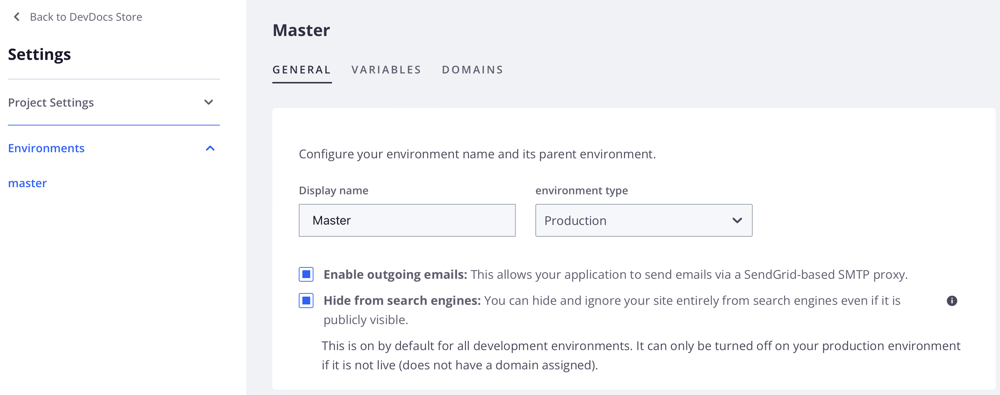

# 발신 이메일 구성

[!DNL Cloud Console] 또는 명령줄에서 통합(및 Starter 전용 스테이징) 환경을 위해 발신 전자 메일을 활성화 및 비활성화할 수 있습니다. 발신 이메일을 활성화하여 Cloud 프로젝트 사용자에 대한 2단계 인증 또는 암호 재설정 이메일을 보냅니다.

기본적으로 발신 이메일은 프로덕션 및 스테이징(Pro 전용) 환경에서 활성화됩니다. 그러나 [명령줄](#enable-emails-in-the-cli) 또는 [클라우드 콘솔](outgoing-emails.md#enable-emails-in-the-cloud-console)을 통해 `enable_smtp` 속성을 설정할 때까지 상태에 관계없이 **[!UICONTROL Enable outgoing emails]** 설정이 환경 설정에서 비활성화되어 표시될 수 있습니다.

[명령줄](#enable-emails-in-the-cli)에 의해 `enable_smtp` 속성 값을 업데이트하면 클라우드 콘솔에서 이 환경에 대한 [!UICONTROL Enable outgoing emails] 설정 값도 변경됩니다.

>[!NOTE]
>
>**[!UICONTROL Enable outgoing emails]** 설정을 활성화/비활성화하면 Pro 스테이징 또는 프로덕션 환경에서 이메일을 활성화/비활성화하지 않습니다.

{{redeploy-warning}}

## Cloud Console에서 이메일 활성화

_환경 구성_ 보기에서 **[!UICONTROL Outgoing emails]** 토글을 사용하여 전자 메일 지원을 활성화하거나 비활성화합니다.

Pro 프로덕션 또는 스테이징 환경에서 발신 이메일을 사용하지 않도록 설정하거나 다시 사용하도록 설정해야 하는 경우 [Adobe Commerce 지원 티켓](https://experienceleague.adobe.com/ko/docs/commerce-knowledge-base/kb/help-center-guide/magento-help-center-user-guide)을 제출할 수 있습니다.

>[!TIP]
>
>발신 이메일 상태는 클라우드 콘솔의 Pro Staging 또는 프로덕션 환경에 반영되지 않을 수 있습니다.

**[!DNL Cloud Console]**&#x200B;에서 전자 메일 지원을 관리하려면:

1. [[!DNL Cloud Console]](https://console.adobecommerce.com)에 로그인합니다.
1. _모든 프로젝트_ 목록에서 프로젝트를 선택하십시오.
1. 프로젝트 대시보드에서 오른쪽 상단의 구성 아이콘을 클릭합니다.
1. **[!UICONTROL Environments]**&#x200B;을(를) 클릭하고 목록에서 특정 환경을 선택합니다(Pro용 스테이징 및 프로덕션 제외).
1. 발신 전자 메일을 활성화하거나 비활성화하려면 _발신 전자 메일 활성화_ **켜기** 또는 **끄기**&#x200B;를 전환하십시오.

   

설정을 변경하면 환경이 빌드되고 새 구성으로 배포됩니다.

## CLI에서 이메일 활성화

`magento-cloud` CLI `environment:info` 명령을 사용하여 `enable_smtp` 속성을 설정하는 활성 환경에 대한 전자 메일 구성을 변경할 수 있습니다. SMTP를 사용하면 메일을 보낼 SMTP 호스트의 IP 주소로 `MAGENTO_CLOUD_SMTP_HOST` 환경 변수를 업데이트합니다.

**명령줄에서 전자 메일 지원을 관리하려면**:

1. 로컬 워크스테이션에서 프로젝트 디렉터리로 변경합니다.

1. 환경에 대한 발신 이메일 설정을 확인합니다.

   ```bash
   magento-cloud environment:info -e <environment-id> | grep enable_smtp
   ```

1. `enable_smtp` 환경 변수를 `true` 또는 `false`(으)로 설정하여 전자 메일 지원 구성을 변경합니다.

   ```bash
   magento-cloud environment:info --refresh -e <environment-id> enable_smtp true
   ```

   환경이 빌드되고 배포될 때까지 기다립니다.

1. SSH를 사용하여 원격 환경에 로그인합니다.

1. 이메일이 작동하는지 확인합니다. 확인할 수 있는 주소로 테스트 이메일을 보냅니다.

   ```bash
   php -r 'mail("mail@example.com", "test message", "just testing", "From: tester@example.com");'
   ```

1. SendGrid에서 이메일을 선택했는지 확인합니다.

   ```bash
   grep mail@example.com /var/log/mail.log
   ```
