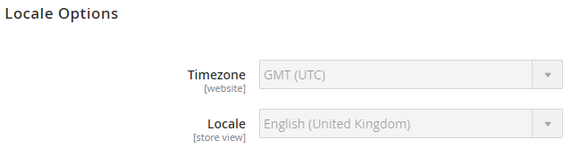

# 시스템별 설정 관리의 예

이 예에서는 구성 관리를 사용하여 모든 환경에서 저장소 설정을 일관되게 유지하는 방법을 보여 줍니다.

이 예제에서는 [스토어 설정](store-settings.md)에 정의된 다음 절차를 사용합니다.

1. 통합 환경 저장소 관리자에 구성을 입력합니다.
1. `config.php` 파일을 만들어 로컬 워크스테이션에 전송합니다.
1. 원격 통합 환경에 `config.php`을(를) 푸시합니다.
1. 관리자에서 설정을 편집할 수 없는지 확인합니다.
1. 필요한 사항을 수정합니다.

   * 통합 환경에서 구성 설정을 변경합니다.
   * 구성을 추가하려면 명령을 실행하여 `config.php`을(를) 다시 만드십시오. 새 구성이 파일에 추가됩니다.
   * 기존 구성을 제거하거나 편집하려면 파일을 수동으로 편집하십시오.
   * 커밋하고 푸시합니다.

예를 들어 다음 설정을 지정할 수 있습니다.

* 통합 환경에서 로케일 및 정적 파일 최적화 설정 비활성화
* 스테이징 및 프로덕션 환경에서 정적 파일 최적화 활성화
* 각각에 대한 특정 자격 증명을 사용하여 스테이징 및 프로덕션에서 Fastly 구성

_정적 파일 최적화_&#x200B;는 JavaScript 및 CSS(Cascading Style Sheet)를 병합하고 축소하고 HTML 템플릿을 축소하는 것을 의미합니다. [정적 콘텐츠 배포 전략](../deploy/static-content.md)을 참조하세요.

## 전제 조건

이러한 구성 관리 작업을 완료하려면 다음이 필요합니다.

* [환경 &quot;관리자&quot;](../project/user-access.md) 권한이 있는 프로젝트 리더 역할
* 통합, 스테이징 및 프로덕션 환경을 위한 관리자 URL 및 자격 증명

## Commerce 관리 구성

통합 환경에서 관리자에 로그인하여 저장소, 웹 사이트, 모듈 또는 확장, 정적 파일 최적화 및 정적 컨텐츠 배포와 관련된 시스템 값에 대한 시스템 구성 설정을 수정할 수 있습니다. [구성 데이터](store-settings.md#scd-performance)를 참조하십시오.

**로케일 및 정적 파일 최적화 설정을 변경하려면**:

1. 통합 환경 관리자에 로그인합니다. [[!DNL Cloud Console]](../project/overview.md)을(를) 통해 이 URL에 액세스할 수 있습니다.
1. **스토어** > 설정 > **구성** > 일반 > **일반**&#x200B;으로 이동합니다.
1. 페이지 탐색에서 **로케일 옵션**&#x200B;을 확장합니다.
1. **로케일** 목록에서 로케일을 변경합니다. 나중에 다시 변경할 수 있습니다.

   

1. **구성 저장**&#x200B;을 클릭합니다.
1. 메시지가 표시되면 [캐시를 플러시](https://experienceleague.adobe.com/en/docs/commerce-admin/systems/tools/cache-management)합니다.
1. 관리자에서 로그아웃합니다.

## 값을 내보내고 config.php를 로컬 시스템으로 전송합니다.

이 단계에서는 로컬 컴퓨터에서 실행하는 명령을 사용하여 통합 환경에서 `config.php` 구성 파일을 만들고 전송합니다.

이 프로시저는 [권장 프로시저](store-settings.md)의 2단계에 해당합니다. `config.php`을(를) 만든 후 Git에 추가할 수 있도록 로컬 시스템으로 전송하십시오.

**`config.php`**&#x200B;을(를) 만들고 전송하려면:

1. 로컬 워크스테이션에서 프로젝트 디렉터리로 변경합니다.

1. 통합 환경으로 변경합니다.

   ```bash
   magento-cloud environment:checkout integration
   ```

1. 원격 데이터베이스의 로컬 덤프를 만듭니다.

   ```bash
   magento-cloud db:dump
   ```

`config.php`의 다음 코드 조각은 기본 로케일을 `en_GB`(으)로 변경하고 정적 파일 최적화 설정을 변경하는 예를 보여 줍니다.

```php?start_inline=1
'general' => [
     'locale' => [
         'code' => 'en_GB',
         'timezone' => 'UTC',
     ],

     ... more ...

 'dev' => [
     'template' => [
         'allow_symlink' => '0',
         'minify_html' => '0',
     ],
     'js' => [
         'merge_files' => '0',
         'enable_js_bundling' => '0',
         'minify_files' => '0',
     ],
     'css' => [
         'merge_css_files' => '0',
         'minify_files' => '0',
     ],

     ... more ...
```

## 환경에 config.php 푸시 및 배포

`config.php`을(를) 만들어 로컬 시스템으로 전송했으므로 Git에 커밋하고 환경에 푸시합니다. 이 프로시저는 [권장 프로시저](store-settings.md)의 3단계 및 4단계에 해당합니다.

다음 명령은 `master` 분기를 추가, 커밋 및 푸시합니다.

```bash
git add app/etc/config.php && git commit -m "Add system-specific configuration" && git push origin master
```

스테이징 및 프로덕션에 전체 코드 배포. Starter의 경우 `staging` 및 `master` 분기로 푸시합니다. 배포 명령에 대한 자세한 내용은 [스토어 배포](../deploy/staging-production.md)를 참조하십시오.

모든 환경에서 배포가 완료될 때까지 기다립니다.

## 구성 변경 사항 확인

`config.php`을(를) 환경에 푸시한 후 변경한 값은 관리에서 읽기 전용이어야 합니다. 이 예제에서 수정된 기본 로케일 및 정적 파일 최적화 설정은 관리자에서 편집할 수 없습니다. 이러한 구성 설정은 `config.php`에서 설정됩니다.

구성 변경 사항을 확인하려면:

1. 환경 중 하나에서 관리자에서 로그아웃합니다.
1. 관리자에 다시 로그인합니다.
1. **스토어** > 설정 > **구성** > 일반 > **일반**&#x200B;을 클릭합니다.
1. 오른쪽 창에서 **로케일 옵션**&#x200B;을 확장합니다.

   다음 샘플과 같이 몇 개의 필드를 편집할 수 없습니다. 이러한 구성 설정은 `config.php`에 의해 유지 관리됩니다.

   

1. 관리자에서 로그아웃합니다.

## 시스템별 구성 설정 변경 및 업데이트

이러한 설정을 수정해야 하는 경우 텍스트 편집기를 사용하여 `config.php` 파일을 수동으로 수정하십시오. 편집 또는 제거를 완료한 후 이전 단계에 따라 커밋하고 원격 환경에 푸시할 수 있습니다.

구성을 추가하려면 통합 환경을 수정하고 명령을 다시 실행하여 파일을 생성합니다. 모든 새 구성은 파일의 코드에 추가됩니다. 이전 단계에 따라 Git에 푸시합니다.

이 예에서는 정적 파일 최적화 설정을 수정하고 JavaScript에 대한 새 설정을 추가합니다.

### 통합에서 구성 추가

통합 환경 관리자에서 구성 값을 추가하려면 다음을 수행합니다. 이 예제는 JavaScript 파일을 병합합니다.

1. 통합 관리자에서 로그아웃합니다.
1. 통합 책임자에 다시 로그인합니다.
1. **스토어** > 설정 > **구성** > **고급** > **개발자**&#x200B;를 클릭합니다.
1. 오른쪽 창에서 **JavaScript 설정**&#x200B;을 확장합니다.
1. **JavaScript 파일 병합** 목록에서 **예**&#x200B;를 클릭합니다.
1. **구성 저장**&#x200B;을 클릭합니다.
1. 메시지가 표시되면 [캐시를 플러시](https://experienceleague.adobe.com/en/docs/commerce-admin/systems/tools/cache-management)합니다.
1. 관리자에서 로그아웃합니다.

dump 명령을 다시 실행하면 새 구성이 파일에 추가됩니다.

```bash
magento-cloud db:dump
```

### 새 설정으로 config.php 편집

로컬에서 텍스트 편집기를 사용하여 업데이트된 `app/etc/config.php` 파일을 편집하십시오. JavaScript, HTML 및 CSS 파일에 대한 축소를 활성화하려면 이 설정을 편집하십시오.

```php?start_inline=1
 'dev' => [
     'template' => [
         'allow_symlink' => '0',
         'minify_html' => '0',
     ],

     ... more ...

     'js' => [
         'merge_files' => '0',
         'enable_js_bundling' => '0',
         'minify_files' => '0',
     ],
     'css' => [
         'merge_css_files' => '0',
         'minify_files' => '0',
     ],
```

축소를 허용하는 설정을 수정하려면 `'minify_html'` 및 각 `'minify_files'` 옵션에 대해 `'0'`을(를) `'1'`(으)로 편집하십시오.

```php?start_inline=1
 'dev' => [
     'template' => [
         'allow_symlink' => '0',
         'minify_html' => '1',
     ],

     ... more ...

     'js' => [
         'merge_files' => '0',
         'enable_js_bundling' => '0',
         'minify_files' => '1',
     ],
     'css' => [
         'merge_css_files' => '0',
         'minify_files' => '1',
     ],
```

변경 사항을 파일에 저장합니다.

### 변경 사항을 Git에 푸시

변경 사항을 푸시하려면 다음을 입력합니다.

```bash
git add app/etc/config.php
```

```bash
git commit -m "Add system-specific configuration and edit settings"
```

```bash
git push origin master
```

배포가 완료될 때까지 기다립니다.

배포 프로세스를 반복하여 코드를 모든 환경에 푸시합니다.
