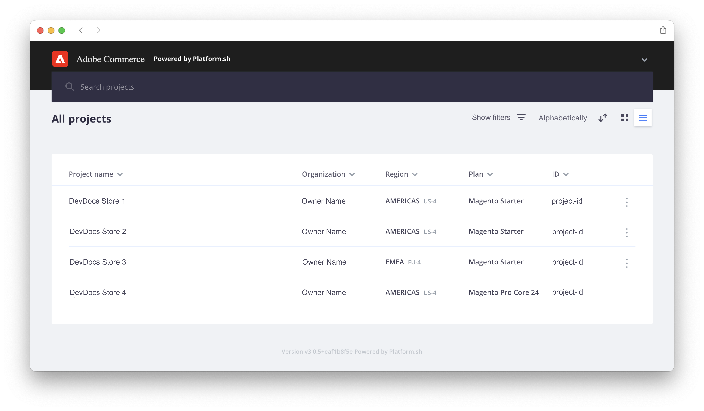

# [!DNL Cloud Console]에 로그인

[!DNL Cloud Console]은(는) Commerce 코드를 빌드하고 관리하고 배포하는 대화형 방법을 제공합니다. [!DNL Cloud Console]은(는) 보다 현대적이고 사용자 친화적인 경험이며 향후 인터페이스 개선을 위한 기반을 제공합니다.

프로젝트 목록을 보려면 [로그인 [!DNL Cloud Console]](https://console.adobecommerce.com)하세요.

## 기능

새 기능 또는 향상된 기능은 다음과 같습니다.

- 프로젝트 및 환경 특성에 대한 명확한 개요
- 정렬 가능한 기록이 있는 활동 스트림
- Starter 프로젝트의 수동 백업 관리 및 기록
- 향상된 로그 보기
- 정렬 가능한 목록
- 통합 추가를 위한 간단한 양식 및 지침
- 웹 컨텐츠 액세스 가능성 지침(WCAG) 준수

![[!DNL Cloud Console]](../assets/CloudConsole.png)

새 기능 또는 개선된 기능은 다음과 같습니다.

| 기능 | 개선 사항 |
| -------------- | ----------------------------------- |
| [활동 스트림](../cloud-guide/project/activity-stream.md) | 실행 중, 보류 중 또는 이전 작업의 정렬 가능한 목록과 상호 작용합니다. 활동을 선택하고 로그를 보거나 실행 중인 빌드를 취소합니다. |
| [프로젝트 및 환경 개요](../cloud-guide/project/overview.md#project-overview) | 프로젝트를 열고 프로젝트 세부 정보 및 환경 목록 개요를 확인합니다. 환경 개요는 환경 상태, 애플리케이션 액세스 및 최근 활동에 대한 자세한 내용을 제공합니다. |
| [통합 양식](../cloud-guide/integrations/overview.md) | 간단한 양식 및 지침을 사용하여 Bitbucket 또는 Slack 알림과 같은 통합을 추가할 수 있습니다. |
| [프로젝트 목록](../cloud-guide/project/overview.md#cloud-console) | _모든 프로젝트_ 보기에는 액세스 권한이 있는 모든 프로젝트가 나열됩니다. **[!UICONTROL Show filters]**&#x200B;을(를) 클릭하고 프로젝트 목록을 유형, 지역 또는 계획별로 필터링할 수 있습니다. |
| [변수 가시성 옵션](../cloud-guide/environment/variable-levels.md) | 빌드 또는 런타임 중 프로젝트 수준 또는 환경 수준 변수의 가시성을 제한합니다. |

<!--
The following are features yet to be activated:
| **Apps and services topology** | The Apps & Services topology is visible on Project and Environment views. This interactive diagram allows you to select a service and view the relationship details, such as name, type, version, port, and more. Click **[!UICONTROL View details]** to access the overview and configuration panel for each service. | 
-->

## 콘솔 질문

**_스냅샷 기능은 어디에서 찾을 수 있습니까_**?

[!DNL Starter] 프로젝트의 경우 이제 스냅샷 기능을 _백업_&#x200B;이라고 합니다. [!DNL Cloud Console]에서 [!DNL Starter] 환경의 수동 백업을 만들거나 Cloud CLI에서 스냅숏을 만들 수 있습니다. 환경에 대한 관리자 역할이 있어야 합니다.

프로젝트 탐색 모음에서 환경을 선택합니다. 환경이 활성화되어 있어야 합니다. **[!UICONTROL Backups]** 탭을 선택합니다. 현재 Pro 환경에서는 이 옵션을 사용할 수 없습니다.

**_환경에 대해 구성된 경로 목록은 어디에 있습니까_**?

환경의 _서비스_ 탭에서 구성된 경로 목록을 찾을 수 있습니다.

프로젝트 탐색 모음에서 환경을 선택합니다. **[!UICONTROL Services]** 탭을 선택합니다. **라우터** 개요에 구성된 경로가 표시됩니다. 현재 새 [!DNL Cloud Console]에서 경로를 추가할 수 없습니다.

## 계정 메뉴

오른쪽 상단에 계정 메뉴가 있습니다. 메뉴의 아래쪽 화살표를 클릭하고 **[!UICONTROL My Profile]**&#x200B;을(를) 선택합니다. _내 프로필_ 보기에서 사용자 세부 정보 및 표시 설정을 제어하고 [보안 인증](../cloud-guide/project/user-access.md#user-authentication-requirements), [API 토큰](../cloud-guide/project/user-access.md#create-an-api-token) 및 [SSH 키](../cloud-guide/development/secure-connections.md)를 관리할 수 있습니다.
