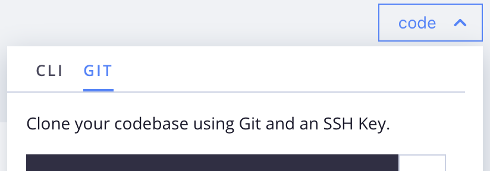

# 개발 준비

Commerce을 처음 사용하든 기존 Commerce 소유자가 클라우드 인프라로 이동하든 관계없이 클라우드 프로젝트를 위한 개발 작업 영역을 준비하려면 다음 단계를 사용하십시오. 이러한 단계 중 일부를 이미 완료했거나 기존 Adobe Commerce 개발자 환경이 있는 경우 예상 결과를 보려면 다음을 검토하고 다음 단계를 계속 진행하십시오. 일부 구성 및 워크플로우는 일반적인 온프레미스 설치와 다릅니다.

## 자격 증명

작업 영역을 설정하기 전에 다음 키 및 계정 액세스 권한을 수집합니다.

- **인증 키(작성기 키)**

  인증 키는 Adobe Commerce 작성기 저장소(`repo.magento.com`) 및 GitHub와 같은 애플리케이션 개발에 필요한 기타 Git 서비스에 대한 보안 액세스를 제공하는 32자 인증 토큰입니다. 계정에 여러 인증 키가 있을 수 있습니다. 작업 영역 설정의 경우 코드 저장소에 대한 특정 키 하나로 시작합니다. 키가 없는 경우 프로젝트 소유자에게 문의하거나 [인증 키](../cloud-guide/development/authentication-keys.md)를 직접 만드십시오.

- **클라우드 프로젝트 계정**

  프로젝트 소유자는 귀하를 Adobe Commerce on cloud infrastructure 프로젝트에 초대해야 합니다. 전자 메일 초대를 받으면 링크를 클릭하고 프롬프트에 따라 계정을 만듭니다. [온보딩](onboarding.md)을 참조하세요.

- **Adobe Commerce 암호화 키**

  기존 시스템만 가져올 경우 데이터베이스에 대한 액세스 및 데이터를 보호하는 데 사용되는 암호화 키를 캡처합니다. 이 키에 대한 자세한 내용은 [암호화 키 문제 해결](https://experienceleague.adobe.com/docs/commerce-knowledge-base/kb/troubleshooting/miscellaneous/resolve-issues-with-encryption-key.html)을 참조하세요.

## 개발자 도구

- **Cloud CLI 설치**

  클라우드 환경을 관리하고 자동화 작업을 실행할 수 있도록 `magento-cloud` CLI를 설치하십시오. 설치 지침은 [Cloud CLI](../cloud-guide/dev-tools/cloud-cli-overview.md)를 참조하십시오.

- **로컬 개발 및 테스트를 위해 도커 설치**

  필요한 경우 도커 환경을 사용하여 로컬 개발을 위해 클라우드 인프라 `integration` 환경에서 Commerce을 에뮬레이션합니다. Adobe Commerce v2 템플릿, Docker 구성 및 `ece-tools` 패키지 등 세 가지 필수 구성 요소가 있습니다.

   - [Docker 아키텍처 및 공통 명령](../cloud-guide/dev-tools/cloud-docker.md)
   - [Launch Docker 개발 환경](https://developer.adobe.com/commerce/cloud-tools/docker/setup/)
   - [ECE-Tools 패키지](../cloud-guide/dev-tools/package-overview.md)

- **Git 기반 서비스 통합**

  선택적으로 GitHub 또는 GitLab과 같은 Git 기반 호스팅 서비스를 클라우드 인프라의 Adobe Commerce과 통합합니다. [통합](../cloud-guide/integrations/overview.md)을 참조하세요.

## 프로젝트 코드

보안 연결은 원격 환경과 상호 작용하기 위해 필수적입니다. 새 프로젝트의 경우 [에 로그인 [!DNL Cloud Console]](https://console.adobecommerce.com)하고 **[!UICONTROL No SSH key]**&#x200B;을(를) 클릭합니다. 이 아이콘은 명령 필드 오른쪽에 있으며 프로젝트에 SSH 키가 없을 때 표시됩니다. [보안 연결](../cloud-guide/development/secure-connections.md#add-an-ssh-public-key-to-your-account)을 참조하세요.

**코드베이스를 로컬 워크스테이션에 복제하려면**:

1. [[!DNL Cloud Console]](https://console.adobecommerce.com)에서 **[!UICONTROL code]**&#x200B;을(를) 클릭하고 **[!UICONTROL Git]** 탭을 선택합니다.

   {width="450"}

1. 제공된 `git clone ...` 명령을 복사합니다.

1. 터미널에서 을 만들고 작업 디렉토리를 변경합니다.

1. `git clone ...` 명령을 붙여 넣고 실행합니다.

>[!TIP]
>
>Adobe은 특정 버전의 Adobe Commerce에 대한 패키지 지침이 포함된 템플릿 저장소를 사용하여 초기 프로젝트 환경을 프로비저닝합니다. [프로젝트 파일 구조](../cloud-guide/project/file-structure.md) 항목을 검토하고 중요한 프로젝트 파일 및 클라우드 템플릿에 대해 자세히 알아보십시오.
